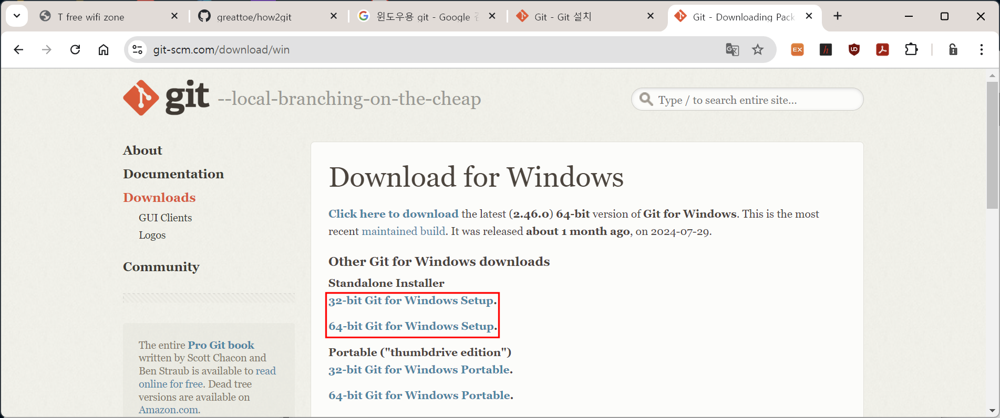
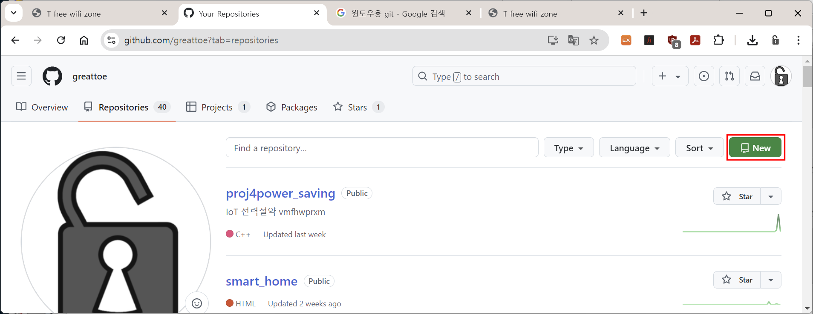
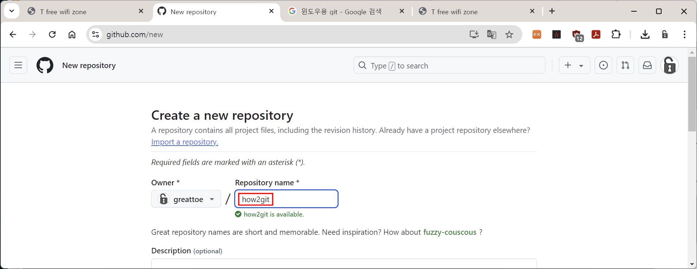
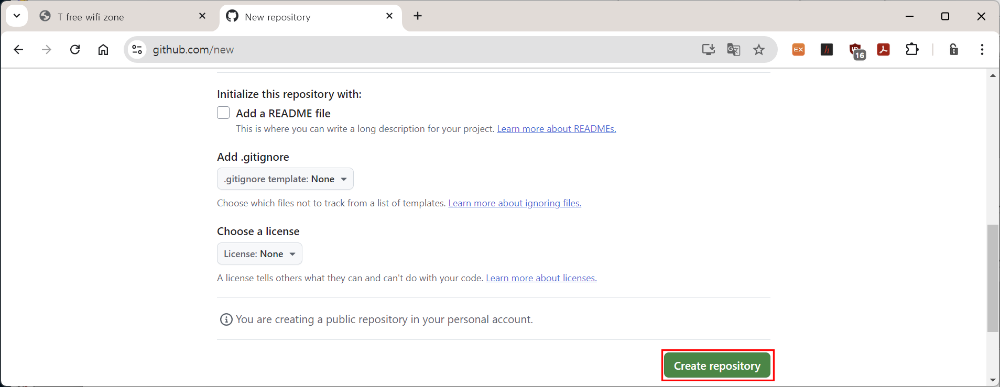
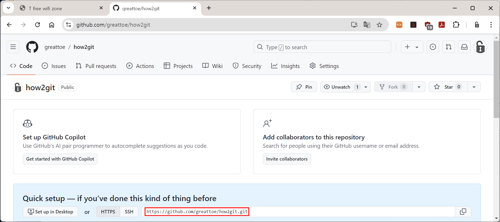
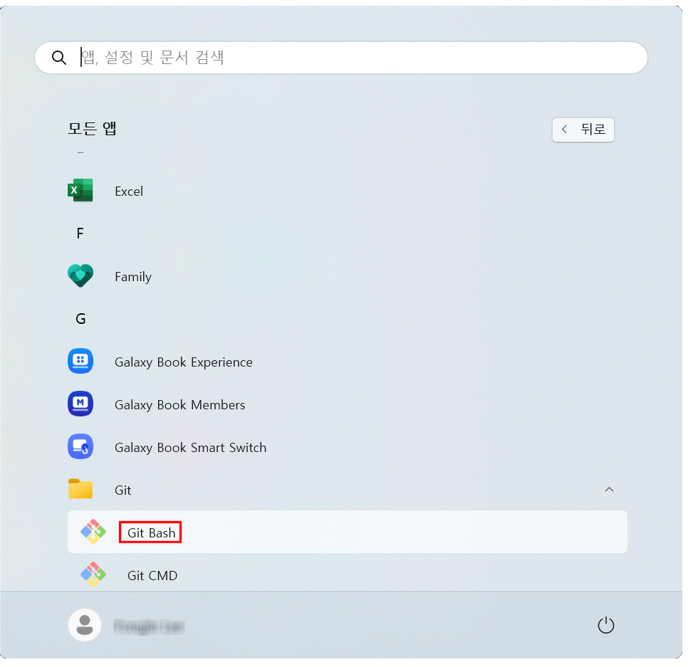

### 1. MS-Windows환경에서의 Git, Github 사용법

---


#### 1.1. Windows용 Git 설치

[**윈도우용 Git 다운로드**](https://git-scm.com/download/win)

위 다운로드 링크를 클릭하면 다음 페이지가 열린다. 사용중인 윈도우가 32비트인지, 64비트인지에 따라 알맞은 설치파일을 다운로드한다.



- **Note Pad++ 설치**

다운로드한 git을 설치하기 앞서 커밋 메세지 편집기로 사용할 `Note Pad ++`를 설치한다. 미리 설치해 두면 Git 설치 과정 중 커밋 메세지 편집기를 선택하는 과정에서 `vi`나 `vim`같은 사용법이 까다로운 편집기 대신 `Note Pad++`를 선택할 수 있다. 아래 다운로드 링크에서 다운로드하여 설치한다. 

[Note Pad++ 다운로드](https://notepad-plus-plus.org/downloads/)


원격 저장소(Repository)를 만들기 위해 웹브라우저에서 자신의 Github계정을 열고, 화면 상단의 `Repositories`메뉴를 클릭한다.


Repositories화면 우측 상단의 버튼을 클릭한다.




Create a new repository화면에서 `Repository name*`란에 원하는 Repository명을 기입한다. 아래 화면의 경우 `how2git`이란 이름의 Repository(원격저장소)를 생성하는 과정이다. 



`Description (optional)`은 해당 원격 저장소의 목적이나 역할을 간단히 기입한다.(비워두어도 상관 없다.)

`Public` 과 `Private`중에서는 `Public`을 선택해야 Github를 무료로 이용할 수 있다. 

`Add a README file`,` Add .gitignore`,` Choose a license`는 일단 그대로 두고, 화면 하단의 **`Create Repository`**버튼을 클릭한다. 



 새로 생성된 Repository(원격 저장소)화면에 표시된 URL(아래그림에 표시한)이 해당 원격저장소의 주소이다. 잘 메모해두자.



해당 원격 저장소와 연결할 지역 저장소를 만들기 위해 `Git Bash`를 실행한다.

윈도우 시작 버튼 - 모든 앱 - `Git` - `Git Bash`



```bash
thumb@nt930 MINGW64 ~
$
```

`pwd`명령`(print working directory)`으로 현재 작업 경로를 확인한다.

```bash
thumb@nt930 MINGW64 ~
$ pwd
/c/Users/thumb

thumb@nt930 MINGW64 ~
$
```

`pwd`명령의 결과로 `/c/Users/thumb`가 출력되었다. C:드라이브의 Users 폴더의 thumb 폴더가 현재 작업 경로라는 뜻이다. 현재 경로에 원격저장소(Repository) `https://github.com/greattoe/how2git.git`와 연결하여 동기화 시킬 지역 저장소 `how2git` 디렉토리(폴더)를 만들기 위해 `mkdir how2git`명령을 실행한다.

```bash
thumb@nt930 MINGW64 ~
$ mkdir how2git

thumb@nt930 MINGW64 ~
$
```

`how2git` 디렉토리(폴더) 생성 확인을 위해 `ls -d how2git`명령을 실행한다.

```bash
thumb@nt930 MINGW64 ~
$ ls -d how2git
how2git/

thumb@nt930 MINGW64 ~
$
```

작업 경로를 `how2git`디렉토리(폴더) 로 변경하기 위해 `cd how2git`명령을 실행한다.

```bash
thumb@nt930 MINGW64 ~
$ cd how2git

thumb@nt930 MINGW64 ~/how2git
$
```

현재 작업 경로에 `.git`폴더의 존재여부 확인을 위해 `ls -d .git`명령을 실행한다.

```
thumb@nt930 MINGW64 ~/how2git
$ ls -d .git
ls: cannot access '.git': No such file or directory

thumb@nt930 MINGW64 ~/how2git
$
```

현재 경로에는 `.git`디렉토리(폴더)가 없다. 현재 작업 경로를 Github와 연동하기 위해 `git init`명령을 실행한다.

```
thumb@nt930 MINGW64 ~/how2git
$ git init
Initialized empty Git repository in C:/Users/thumb/how2git/.git/

thumb@nt930 MINGW64 ~/how2git (master)
$
```

현재 작업 경로에 `.git`폴더의 존재 여부 확인을 위해 `ls -d .git`명령을 실행한다.

```
ls -d .git
.git/

thumb@nt930 MINGW64 ~/how2git (master)
$
```

Github 로그인 시 사용하는 E-Mail 설정을 위해 `git config --global user.email "[user email]"`명령을 실행한다.

```bash
thumb@nt930 MINGW64 ~/how2git (master)
$ git config --global user.email "greattoe@gmail.com"

thumb@nt930 MINGW64 ~/how2git (master)
$
```

E-Mail 설정 확인을 위해 `git config user.email`명령을 실행한다.

```bash
thumb@nt930 MINGW64 ~/how2git (master)
$ git config user.email
greattoe@gmail.com

thumb@nt930 MINGW64 ~/how2git (master)
$
```


Github 사용자 명 설정을 위해 `git config --global user.name "[user name]"`명령을 실행한다.

```bash
thumb@nt930 MINGW64 ~/how2git (master)
$ git config --global user.name "Lee Yongjin"

thumb@nt930 MINGW64 ~/how2git (master)
$
```

Github 사용자 명 설정 확인을 위해 `git config user.name`명령을 실행한다.

```bash
thumb@nt930 MINGW64 ~/how2git (master)
$ git config user.name
Lee Yongjin

thumb@nt930 MINGW64 ~/how2git (master)
$
```

지역 저장소(현재 폴더)와 원격저장소(Github Repository)의 연결상태 확인을 위해 `git remote -v`명령을 실행한다.

```
thumb@nt930 MINGW64 ~/how2git (master)
$ git remote -v

thumb@nt930 MINGW64 ~/how2git (master)
$
```

연결된 원격저장소가 없어서 아무것도 출력되지 안는다.


앞서 새로만든 Repository화면에서 알아둔 Repository URL을 이용해 원격 저장소와 지역 저장소를 연결하기 위해 `git remote add origin https://github.com/greattoe/how2git.git`명령을 실행한다.

```
thumb@nt930 MINGW64 ~/how2git (master)
$ git remote add origin https://github.com/greattoe/how2git.git

thumb@nt930 MINGW64 ~/how2git (master)
$
```

다시 지역 저장소(현재 폴더)와 원격저장소(Github Repository)의 연결상태 확인을 위해 `git remote -v`명령을 실행한다.

```
thumb@nt930 MINGW64 ~/how2git (master)
$ git remote -v
origin  https://github.com/greattoe/how2git.git (fetch)
origin  https://github.com/greattoe/how2git.git (push)

thumb@nt930 MINGW64 ~/how2git (master)
$
```

`fetch`URL과 `push`URL이 등록된 것을 확인할 수 있다. 

이제 Github와 연동시킬 데이터를 지역 저장소에 복사한다.


[목차](../README.md) 
